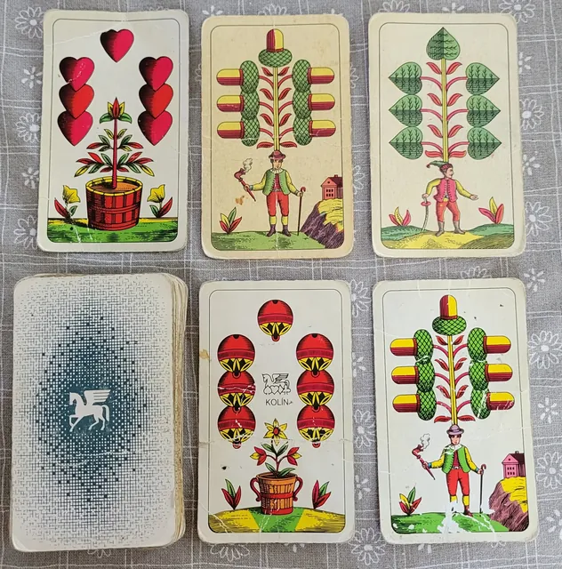

# Agresivní prší...

...je karetní hra, jejíž nosnou změnou oproti klasickému prší (kp) je možnost zahrát téměř kdykoliv. Jde tedy i o rychlost a schopnost prosadit se.  
Oproti kp je třeba několik změn, které dělají hru celkově zábavnější a vyrovnanější.

## Začátek hry

Rozdá se 6 karet každému. Cílem je zbavit se jich rychleji než spoluhráči.  
Hru startuje první hráč na tahu (ten po levici rozdávajícího) odhozením padnoucí karty nebo líznutím. V tu chvíli může další padnoucí kartu odhodit kdokoliv kromě hráče, který zahrál poslední tah.  
Hráči odhazují karty, dokud nenastane jedna z přerušujících událostí – sedma, eso nebo svršek.

## Sedma

Jako v kp i zde sedma působí dalšímu hráči na tahu újmu v podobě nutnosti nabrat si z paklíku karty. Hra se zde zastaví, protože na sedmu musí zahrát hráč, který je další v pořadí (po směru hodinových ručiček).  
Další hráč může odpovědět další sedmou, nebo si líznout. V případě lizu je hra ostatními hráči zahájena ihned, jakmile se dotčený hráč dotkne balíčku.

Na sedmu se nelížou 2 karty za každou sedmu, ale pouze jedna, a maximálně 3 celkem (když se objeví 3 nebo 4 sedmy za sebou). Je to proto, že 2 karty za sedmu jsou příliš trestající a hráč se z návalu karet většinou nevzpamatuje.

Další změnou oproti kp je nutnost vyřknout "kykyryký" v okamžiku odhození sedmy. Pokud to hráč neudělá, musí si kartu líznout on sám.

## Eso

Podobně jako u sedmy se čeká, co další hráč udělá: buď hodí další eso, nebo řekne "stojím". Od tohoto okamžiku hra pokračuje agresivním způsobem.

## Svršek

Stejně jako v kp může být svršek zahrán na cokoliv a mění barvu. Hráč, který odhodí svrška, může chvíli počkat, než oznámí barvu, na kterou mění. Obvykle ale barvu oznámí přímo při odhazování. Hra pak pokračuje agresivním tempem.

## Lízačka

Protože není dané pevné pořadí, ve kterém se odhazují karty, není také striktně určeno, že si musíte líznout, pokud nemáte co odhodit – většinou stačí počkat, až se odhazovací balíček správně "vybarví".  
Líznout si však můžete kdykoliv v aktivní fázi hry (pokud zrovna není přerušeno sedmou nebo esem) – někdy je to dokonce výhodné.

Občas nastává situace, kdy nikdo nemá co odhodit a všichni vyčkávají. Líznutím a následným odhozením můžete hru posunout vpřed. V tomto případě platí, že hráč, který zahrál poslední kartu, může odhodit na svou vlastní kartu, pokud si jiný hráč lízne.

Líznutí má ale své nevýhody – za prvé, hra pokračuje od chvíle, kdy se dotknete balíčku, a za druhé, chvíli trvá, než kartu otočíte a "pochopíte". Pokud si delší dobu (několik sekund) nechce žádný hráč líznout, musí si líznout hráč s nejmenším počtem karet. Pokud je takových hráčů více, má "přednost" ten, který je po směru hodinových ručiček blíže poslednímu aktivnímu hráči (poslední, kdo lízal nebo odhodil).

## Kulový spodek

Toto je skutečně (volitelná) specialita agresivního prší.  
Odhodíte-li kulového spodka, musíte udeřit jakéhokoliv hráče. Umocňuje (nebo ventiluje?) to agresivitu, ale zároveň lehce odvádí koncentraci od odhazování karet - jak pro udeřeného, tak úderce.

Pokud hráč zapomene udeřit po odhození kulového spodka, ostatní mají právo udeřit jeho. Důležité je, že kulový spodek není přerušující událost – mlátíte se během toho, co odhazujete karty!

## Poznámky

- Hra končí, když jsou ve hře pouze dva hráči (ve dvou by se hrálo kp). Prohraje (a rozdává v dalším kole) ten kdo má více karet. Pokud mají stejně, prohrává ten co odhodil (nebo líznul) hlouběji v minulosti.
- Jedna hra trvá približně minutu - je to celkem frkot.
- Stává se, že při odhazování se karty vhodí špatně - především z důvodu rychlosti a neustálé změny barev a hodnot. Pokud se tak stane, platí nejrychlejší karta a všechny špatné se vrací hráčům (a ihned se zase hraje).
